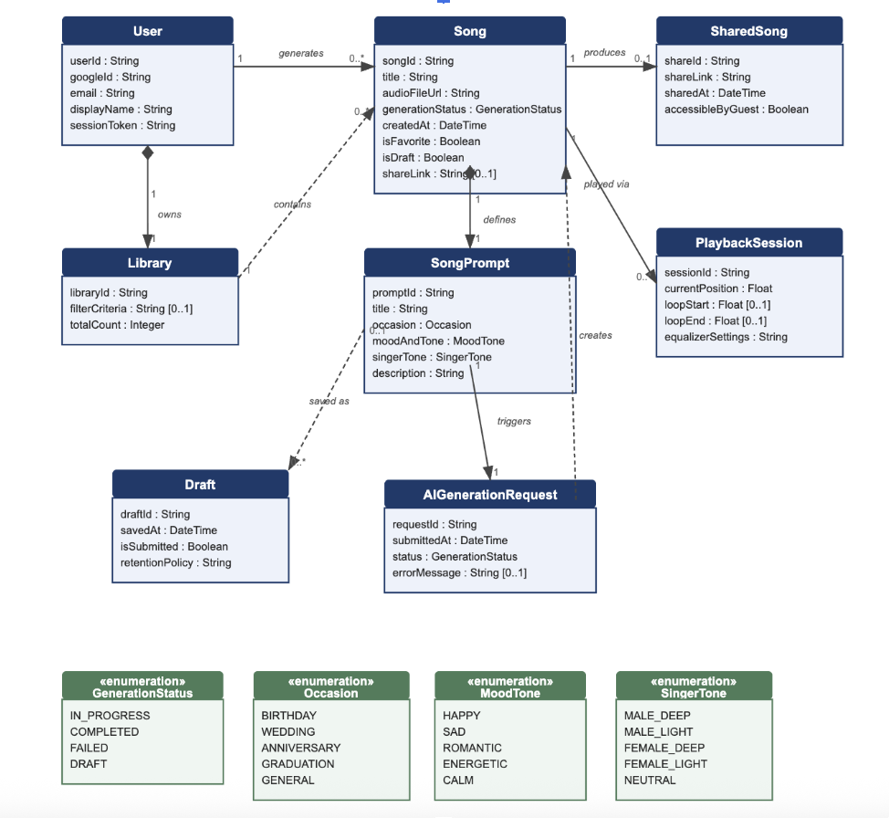

# Melodai Ai Song Generation

A Django REST API for AI-powered song generation, implementing the **Strategy Pattern** to support multiple interchangeable generation backends — **Mock** (offline, instant) and **Suno** (real external API).

---

## Project Structure

```
ai-song-domain/
├── backend/                        # Django REST API
│   ├── config/                     # Project settings & URLs
│   ├── songs/
│   │   ├── generation/
│   │   │   ├── base.py             # Strategy interface (ABC)
│   │   │   ├── factory.py          # Strategy factory + runtime override
│   │   │   ├── service.py          # run_generation / refresh_generation_status
│   │   │   ├── types.py            # SongGenerationRequest / Result dataclasses
│   │   │   └── strategies/
│   │   │       ├── mock.py         # MockSongGeneratorStrategy
│   │   │       └── suno.py         # SunoSongGeneratorStrategy
│   │   ├── models/                 # Domain models
│   │   ├── serializers/
│   │   ├── views/
│   │   └── management/commands/    # seed, demo_generation
│   ├── .env.example
│   └── requirements.txt
└── frontend/                       # React + Vite (Create Music, My Library)
```

---

## Setup

**Requirements:** Python 3.11+, Node.js 18+

### Backend

```bash
cd backend
python3 -m venv venv && source venv/bin/activate   # Windows: venv\Scripts\activate
pip install -r requirements.txt
cp .env.example .env                               # then fill in values
python manage.py migrate
python manage.py seed                              # optional: load sample data
python manage.py runserver
```

| URL                            | Purpose       |
| ------------------------------ | ------------- |
| `http://127.0.0.1:8000/api/`   | JSON REST API |
| `http://127.0.0.1:8000/admin/` | Django Admin  |

### Frontend

```bash
cd frontend
npm install
npm run dev
```

Open `http://localhost:5173` in your browser.

The frontend connects to the backend at `http://127.0.0.1:8000`. It has two pages:

- **Create Music** — fill in a prompt, generate a song (Mock or Suno), and play it
- **My Library** — view all generated songs, toggle favorites, delete

The active generation strategy is shown in the top-right corner of the nav bar. Click it to toggle between Mock and Suno without restarting the server.

---

## Environment Variables

Copy `.env.example` to `.env` and configure the values. **Never commit `.env`** — it is gitignored.

```env
# Generation strategy: mock (default) | suno
GENERATOR_STRATEGY=mock

# Required only when GENERATOR_STRATEGY=suno
SUNO_API_KEY=your_bearer_token_here

```

---

## Strategy Pattern Overview

The generation layer uses the **Strategy Pattern** so that generation behavior can be swapped without changing any other part of the system.

| Component          | File                                  | Role                                                                            |
| ------------------ | ------------------------------------- | ------------------------------------------------------------------------------- |
| Strategy Interface | `songs/generation/base.py`            | `SongGenerationStrategy` (ABC) with `generate()` + `fetch_status()`             |
| Mock Strategy      | `songs/generation/strategies/mock.py` | Offline, deterministic, completes instantly                                     |
| Suno Strategy      | `songs/generation/strategies/suno.py` | Calls Suno API, returns a `taskId` for polling                                  |
| Factory            | `songs/generation/factory.py`         | Reads `GENERATOR_STRATEGY` from env/settings, instantiates the correct strategy |
| Service            | `songs/generation/service.py`         | Orchestrates `run_generation()` and `refresh_generation_status()`               |

**Strategy is selected via environment variable — selection is centralized in `factory.py` with no scattered `if/else` across the codebase.**

---

## Testing Guide

Make sure the backend is running at `http://127.0.0.1:8000` before you start.

---

### Option 1 — Management Command (Easiest, Mock only)

One command. No setup needed.

```bash
cd backend
python manage.py demo_generation
```

Expected output:

```
Active strategy: MockSongGeneratorStrategy
external_task_id='mock-xxxxxxxxxxxxxxxx'
external_status='SUCCESS'
ai_status=COMPLETED
song.generation_status=COMPLETED
song.audio_file_url='https://...'
```

---

### Option 2 — Web UI (Recommended for full flow)

The frontend supports both Mock and Suno with no extra setup.

1. Start both servers (backend + frontend)
2. Open `http://localhost:5173` and log in
3. Click the **Mock / Suno badge** in the top-right to switch strategy
4. Go to **Create Music**, fill in the form, and click **Generate**
5. Check **My Library** to see the result — use the 🔄 button to sync status if needed

---

### Option 3 — Browsable API (No curl needed)

Django REST Framework provides a built-in web interface for every endpoint.

Open any of these in your browser:

| URL                                                        | What you can do         |
| ---------------------------------------------------------- | ----------------------- |
| `http://127.0.0.1:8000/api/`                               | Browse all endpoints    |
| `http://127.0.0.1:8000/api/generation-config/`             | Check/switch strategy   |
| `http://127.0.0.1:8000/api/generation-requests/`           | List or create requests |
| `http://127.0.0.1:8000/api/generation-requests/{id}/run/`  | Trigger generation      |
| `http://127.0.0.1:8000/api/generation-requests/{id}/poll/` | Poll status             |

Each page has an HTML form — just fill in the JSON body and click **POST**.

---

### Option 4 — curl / Postman (Advanced)

Run each step in order. Copy the `id` from each response and export it before the next step.

```bash
export BASE=http://127.0.0.1:8000/api
```

---

**Step 1 — Create a user**

```bash
curl -s -X POST "$BASE/users/get-or-create/" \
  -H "Content-Type: application/json" \
  -d '{"username":"testuser"}' \
  | python3 -m json.tool
```

```json
{
  "id": 15,
  "user_id": "b86846ae-...",
  "username": "testuser",
  "display_name": "testuser"
}
```

```bash
export USER_ID=<id from response above>   # use the number (e.g. 15), NOT the UUID
```

---

**Step 2 — Create a song**

```bash
curl -s -X POST "$BASE/songs/" \
  -H "Content-Type: application/json" \
  -d "{\"user_id\":$USER_ID,\"title\":\"My Song\",\"generation_status\":\"DRAFT\",\"is_draft\":true}" \
  | python3 -m json.tool
```

```bash
export SONG_ID=<id from response above>   # use the number, NOT song_id UUID
```

---

**Step 3 — Create a prompt**

```bash
curl -s -X POST "$BASE/song-prompts/" \
  -H "Content-Type: application/json" \
  -d "{\"song_id\":$SONG_ID,\"title\":\"Birthday Song\",\"occasion\":\"BIRTHDAY\",\"mood_and_tone\":\"HAPPY\",\"singer_tone\":\"NEUTRAL\",\"description\":\"\"}" \
  | python3 -m json.tool
```

Valid values — `occasion`: BIRTHDAY · WEDDING · ANNIVERSARY · GRADUATION · GENERAL | `mood_and_tone`: HAPPY · SAD · ROMANTIC · ENERGETIC · CALM | `singer_tone`: MALE_DEEP · MALE_LIGHT · FEMALE_DEEP · FEMALE_LIGHT · NEUTRAL

```bash
export PROMPT_ID=<id from response above>   # use the number, NOT prompt_id UUID
```

---

**Step 4 — Create a generation request**

```bash
curl -s -X POST "$BASE/generation-requests/" \
  -H "Content-Type: application/json" \
  -d "{\"prompt_id\":$PROMPT_ID}" \
  | python3 -m json.tool
```

> If you get `409 Conflict`, the request already exists — use the `id` from the response.

```bash
export REQ_ID=<id from response above>   # use the number (e.g. 29), NOT request_id UUID
```

---

**Step 5 — Switch strategy, then run generation**

**For Mock** (no API key needed):

```bash
# Switch to mock
curl -s -X POST "$BASE/generation-config/" \
  -H "Content-Type: application/json" \
  -d '{"generator_strategy":"mock"}' | python3 -m json.tool

# Run — completes immediately
curl -s -X POST "$BASE/generation-requests/$REQ_ID/run/" \
  -H "Content-Type: application/json" \
  -d '{}' | python3 -m json.tool
```

Expected: `"status": "COMPLETED"`, `"external_task_id": "mock-..."`

---

**For Suno** (requires `SUNO_API_KEY` in `.env`):

```bash
# Switch to suno
curl -s -X POST "$BASE/generation-config/" \
  -H "Content-Type: application/json" \
  -d '{"generator_strategy":"suno"}' | python3 -m json.tool

# Run — returns IN_PROGRESS with a taskId
curl -s -X POST "$BASE/generation-requests/$REQ_ID/run/" \
  -H "Content-Type: application/json" \
  -d '{}' | python3 -m json.tool

# Poll until status = SUCCESS (repeat every few seconds)
curl -s -X POST "$BASE/generation-requests/$REQ_ID/poll/" \
  -H "Content-Type: application/json" \
  -d '{}' | python3 -m json.tool
# PENDING → TEXT_SUCCESS → FIRST_SUCCESS → SUCCESS
```

**Switch strategy at runtime (no restart):**

| Action                 | Request                                                           |
| ---------------------- | ----------------------------------------------------------------- |
| Check current strategy | `GET /api/generation-config/`                                     |
| Switch to Mock         | `POST /api/generation-config/` `{"generator_strategy": "mock"}`   |
| Switch to Suno         | `POST /api/generation-config/` `{"generator_strategy": "suno"}`   |
| Revert to `.env`       | `POST /api/generation-config/` `{"clear_runtime_override": true}` |

---

## REST API Reference

### Resources

| Endpoint                    | Resource            | Methods                       |
| --------------------------- | ------------------- | ----------------------------- |
| `/api/users/`               | User                | GET, POST, PUT, PATCH, DELETE |
| `/api/songs/`               | Song                | GET, POST, PUT, PATCH, DELETE |
| `/api/libraries/`           | Library             | GET, POST, PUT, PATCH, DELETE |
| `/api/song-prompts/`        | SongPrompt          | GET, POST, PUT, PATCH, DELETE |
| `/api/generation-requests/` | AIGenerationRequest | GET, POST, PUT, PATCH, DELETE |
| `/api/shared-songs/`        | SharedSong          | GET, POST, PUT, PATCH, DELETE |
| `/api/playback-sessions/`   | PlaybackSession     | GET, POST, PUT, PATCH, DELETE |
| `/api/drafts/`              | Draft               | GET, POST, PUT, PATCH, DELETE |

### Generation Actions

| Endpoint                              | Method | Description                                        |
| ------------------------------------- | ------ | -------------------------------------------------- |
| `/api/users/get-or-create/`           | POST   | Create or retrieve user by `username`              |
| `/api/generation-requests/{id}/run/`  | POST   | Execute generation with current strategy           |
| `/api/generation-requests/{id}/poll/` | POST   | Poll Suno task status (`record-info`)              |
| `/api/songs/{id}/sync-status/`        | POST   | Re-sync song status from latest generation request |
| `/api/generation-config/`             | GET    | View current strategy + source + suno key status   |
| `/api/generation-config/`             | POST   | Switch strategy or clear runtime override          |

---

## Domain Model



Full field definitions and relationships are in `backend/songs/models/`.
