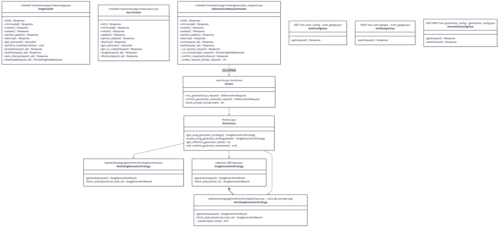

# Class diagram (UML)

Views, service layer, factory, and **Strategy** implementations. DRF: `list` / `retrieve` / `create` / `update` / `destroy` map to the usual HTTP verbs. Source: `backend/songs/views/`, `backend/songs/generation/`, `songs/generation/service.py`, `songs/generation/factory.py`.

## Mermaid (source — safe to hand in as text / GitHub renders it)

```mermaid
classDiagram
  direction TB

  class ModelViewSet {
    <<DRF>>
  }
  class UserViewSet
  class SongViewSet
  class LibraryViewSet
  class SongPromptViewSet
  class AIGenerationRequestViewSet
  class SharedSongViewSet
  class PlaybackSessionViewSet
  class DraftViewSet

  ModelViewSet <|-- UserViewSet
  ModelViewSet <|-- SongViewSet
  ModelViewSet <|-- LibraryViewSet
  ModelViewSet <|-- SongPromptViewSet
  ModelViewSet <|-- AIGenerationRequestViewSet
  ModelViewSet <|-- SharedSongViewSet
  ModelViewSet <|-- PlaybackSessionViewSet
  ModelViewSet <|-- DraftViewSet

  class "auth_config() @api_view" as AuthConfig
  class "auth_google() @api_view" as AuthGoogle
  class "generation_config() @api_view" as GenerationConfig

  class "service.py" as ServiceModule {
    <<module>>
    +run_generation()
    +refresh_generation_status()
  }

  class "factory.py" as FactoryModule {
    <<module>>
    +get_song_generator_strategy()
    +create_song_generator_strategy()
  }

  class SongGenerationStrategy {
    <<Abstract>>
    +generate() SongGenerationResult
    +fetch_status() SongGenerationResult
  }
  class MockSongGeneratorStrategy
  class SunoSongGeneratorStrategy

  SongGenerationStrategy <|-- MockSongGeneratorStrategy
  SongGenerationStrategy <|-- SunoSongGeneratorStrategy
  FactoryModule ..> MockSongGeneratorStrategy
  FactoryModule ..> SunoSongGeneratorStrategy

  AIGenerationRequestViewSet ..> ServiceModule
  SongViewSet ..> ServiceModule
  ServiceModule ..> FactoryModule
  ServiceModule ..> SongGenerationStrategy
  GenerationConfig ..> FactoryModule

  note for AuthConfig "GET /api/auth/config/"
  note for AuthGoogle "POST /api/auth/google/"
  note for AIGenerationRequestViewSet "run poll stream"
  note for SongGenerationStrategy "persistence in service, not in strategy"
```

**Implementation notes (same as the diagram footnotes):**

* **`auth_config` / `auth_google` / `generation_config`** are **functions** with `@api_view`, not DRF `APIView` subclasses — they are drawn as named callables in Mermaid.
* **`SunoSongGeneratorStrategy`** calls the provider over **`requests`** in `generate` / `fetch_status`.
* **Enums (domain text fields):** `Song.generation_status` and `AIGenerationRequest.status` use `GenerationStatus`. `SongPrompt` uses `Occasion`, `MoodTone`, `SingerTone` — see `backend/songs/models/*.py`.
* **Persistence / ERD** for entities: `backend/songs/models/`.

## Exported image (optional)

For slides or print, the same layout (earlier export) is also available as a bitmap:



← [Back to main README](../README.md#system-documentation)
