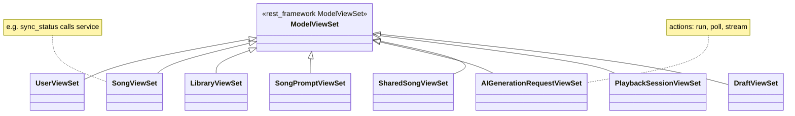
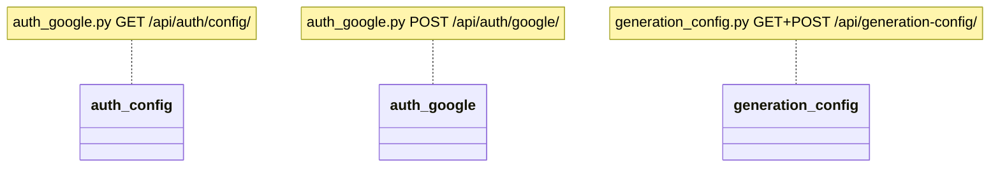
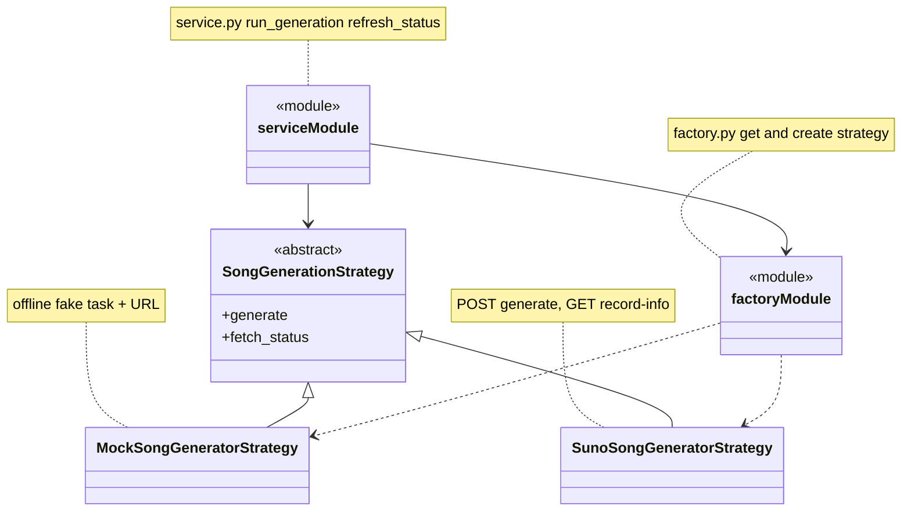

# Class diagram (UML)

**REST API + generation (Strategy pattern)** in `backend/songs/`. The diagram is easier to read in **three layers**:

| Layer | What it is |
|-------|------------|
| **1. ViewSet** | `ModelViewSet` per resource (user, song, library, …) |
| **2. Non-ViewSet routes** | `auth_config`, `auth_google`, `generation_config` — `@api_view` functions, not a `ViewSet` |
| **3. Generation** | `SongGenerationStrategy` (Mock / Suno) + `factory.py` + `service.py` |

Standard DRF `list` / `retrieve` / `create` / … map to HTTP as usual for each route.

---

## 1) All ViewSets

**In the repo:** `views/user.py`, `song.py`, `library.py`, `song_prompt.py`, `ai_generation_request.py`, `shared_song.py`, `playback_session.py`, `draft.py` — re-exported from `views/__init__.py`.

---

## 2) Function-based endpoints (not ViewSet)

---

## 3) Strategy + factory + service

- **`factory.py`** reads `GENERATOR_STRATEGY` and any **runtime** override (via `generation_config`) and instantiates **Mock** or **Suno**.
- **`service.py`** calls `get_song_generator_strategy()` then `generate` / updates **`Song`** and **`AIGenerationRequest`** — **strategies do not write the DB** themselves.
- **`SunoSongGeneratorStrategy`** calls the provider with **`requests`**.

**How this ties to ViewSets:** `AIGenerationRequestViewSet` (actions `run` / `poll`) and `SongViewSet` (e.g. `sync_status`) call into `service.py` — arrows to `service` are not duplicated in the diagrams above to avoid clutter; the **code imports `service` directly**.

---

## Notes

* **Domain entities / ERD:** [`domain-model.md`](domain-model.md)
* **Domain enum values** (`GenerationStatus`, etc.): `backend/songs/models/`

← [Back to main README](../README.md#system-documentation)
