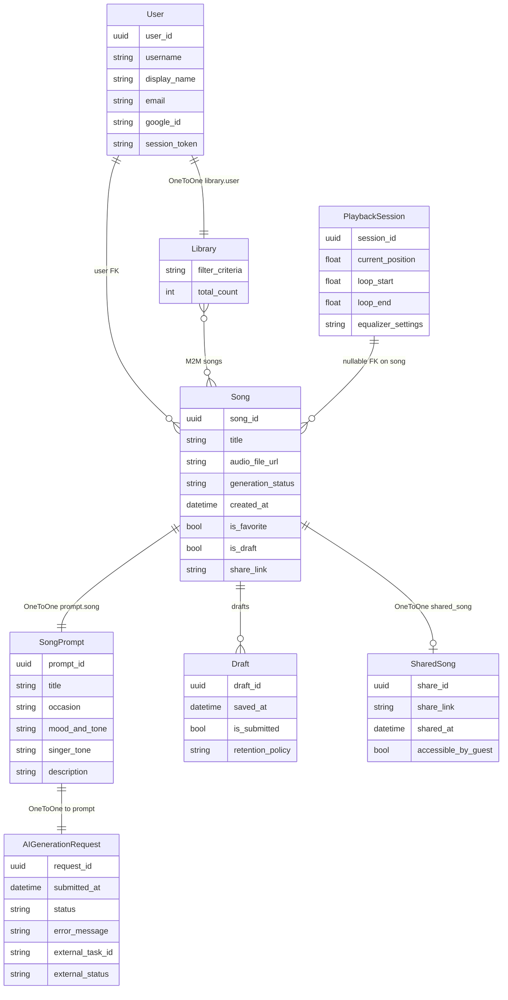

# Domain model

Overview figure, **Mermaid ERD**, and **enumerations** — aligned 1:1 with `backend/songs/models/`.

**Conventions (Django):** Every `models.Model` has an autoincrement integer primary key **`id`** in the database (not shown in the diagram below). The UUID fields such as `user_id`, `song_id`, etc. are **additional** business identifiers (`unique=True`, `editable=False`) as in the source files.

## Entity–relationship (Mermaid)

Relationships match ForeignKey / OneToOne / ManyToMany in code:

* **Library** — `user` = `OneToOneField` to **User** (each user at most one library record).
* **Song** — `user` = `ForeignKey` to **User**; `playback_session` = optional `ForeignKey` to **PlaybackSession** (`null=True`); a single **PlaybackSession** can be shared by many **Song** rows (`related_name="songs"`), or songs may leave it unset.
* **Library** ↔ **Song** — `ManyToManyField` `Library.songs` / `Song.libraries`.
* **SongPrompt** — `OneToOneField` to **Song** (`related_name="prompt"`).
* **AIGenerationRequest** — `OneToOneField` to **SongPrompt** (`related_name="generation_request"`).
* **Draft** — `ForeignKey` to **Song** (`related_name="drafts"`, 0..* drafts per song).
* **SharedSong** — `OneToOneField` to **Song** (`related_name="shared_song"`, 0 or 1 per song).

**Field / type details (code parity):**

| Entity | Django notes |
|--------|----------------|
| **User** | `email` default `""`; `google_id` / `session_token` may be `NULL` in DB. |
| **Library** | `filter_criteria` `max_length=500`, blank; `total_count` `PositiveIntegerField`, default 0. |
| **Song** | `generation_status` uses **`GenerationStatus`** (see below); `share_link` / `audio_file_url` may be blank. |
| **PlaybackSession** | `loop_start` / `loop_end` nullable `FloatField`. |
| **SongPrompt** | `occasion` / `mood_and_tone` / `singer_tone` are `CharField` with **Occasion / MoodTone / SingerTone** choices. |
| **AIGenerationRequest** | `status` uses **`GenerationStatus`**; `error_message` / `external_*` may be blank. |
| **Draft** | `retention_policy` may be blank. |
| **SharedSong** | `share_link` `URLField` `unique=True`. |

## Enumerations (`TextChoices`)

Values below are the **database / API string values** (same as `backend/songs/models/*.py`).

| Enum | Values |
|------|--------|
| **GenerationStatus** | `IN_PROGRESS`, `COMPLETED`, `FAILED`, `DRAFT` — used on **Song** and **AIGenerationRequest**. |
| **Occasion** | `BIRTHDAY`, `WEDDING`, `ANNIVERSARY`, `GRADUATION`, `GENERAL` — **SongPrompt.occasion**. |
| **MoodTone** | `HAPPY`, `SAD`, `ROMANTIC`, `ENERGETIC`, `CALM` — **SongPrompt.mood_and_tone**. |
| **SingerTone** | `MALE_DEEP`, `MALE_LIGHT`, `FEMALE_DEEP`, `FEMALE_LIGHT`, `NEUTRAL` — **SongPrompt.singer_tone**. |

← [Back to main README](../README.md#system-documentation)
