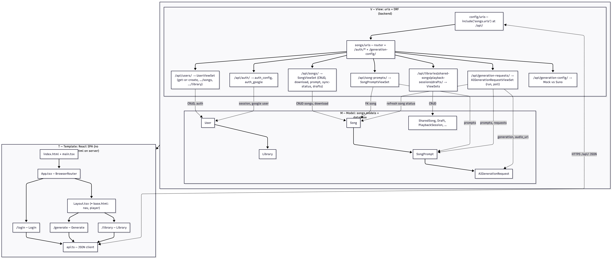

# MVT architecture (Django-style map, this repo)

Same **idea** as a textbook **Model–View–Template** diagram: **URL router → View modules → (Model & Template)**. Here **Template** is **not** `templates/*.html` — the UI is a **Vite + React** SPA. **Models** are `songs.models`; **views** are DRF `ViewSet` / `@api_view` in `songs.views`, backed by `serializers` and (for generation) `generation/service.py` + strategies.

| Layer | What it represents in *this* project |
|------|--------------------------------------|
| **M** | `backend/songs/models/*.py` and the DB (`db.sqlite3`) |
| **V** | `backend/config/urls.py` → `songs/urls` → `*ViewSet` and function views; JSON in/out |
| **T** | `frontend/src/*` — React “pages” and `api.ts` (like HTML templates + JS, but component-based) |

**Logic (same as course MVT, adapted):**

* **Model:** one Python class per main table/aggregate — see `songs/models/`.
* **View:** `APIView` / `ViewSet` style handlers (DRF) or `@api_view` for auth; they **read/write Models** and return **JSON** (not `render()` of templates).
* **Template:** the **browser UI** under `frontend/src/`. A **“base”** shell is `Layout.tsx` (nav, player) — child routes are like ``; **no** `templates/songgenerationrequest/` folder on the server.

**End-to-end flow:** **T** (React) issues **JSON** requests to **V**; **V** uses **Serializers** and talks to **M**; generation **V** also calls `run_generation` / `refresh_generation_status` (service + Suno or Mock) which update **M**. There is no server **render** of HTML pages — only the API and admin.

← [Back to main README](../README.md#system-documentation)
